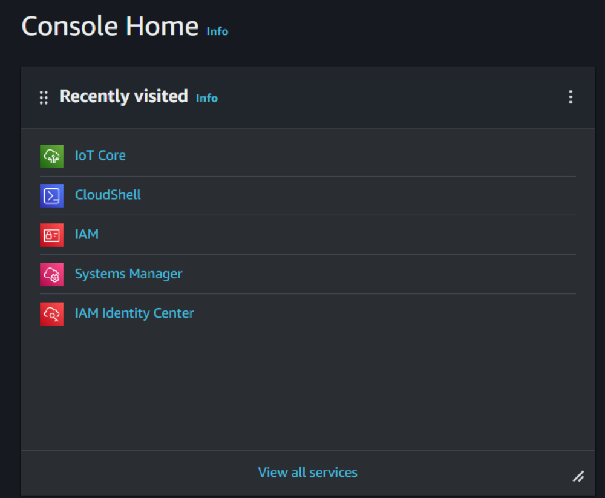
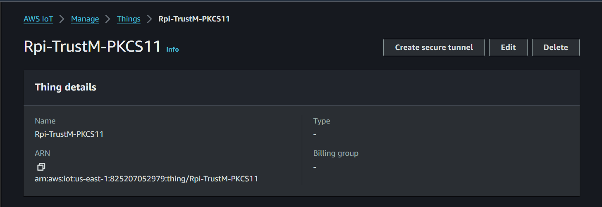
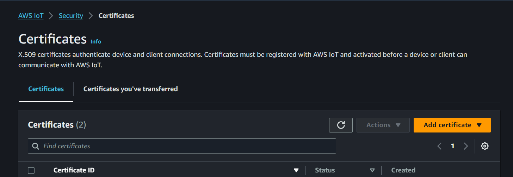
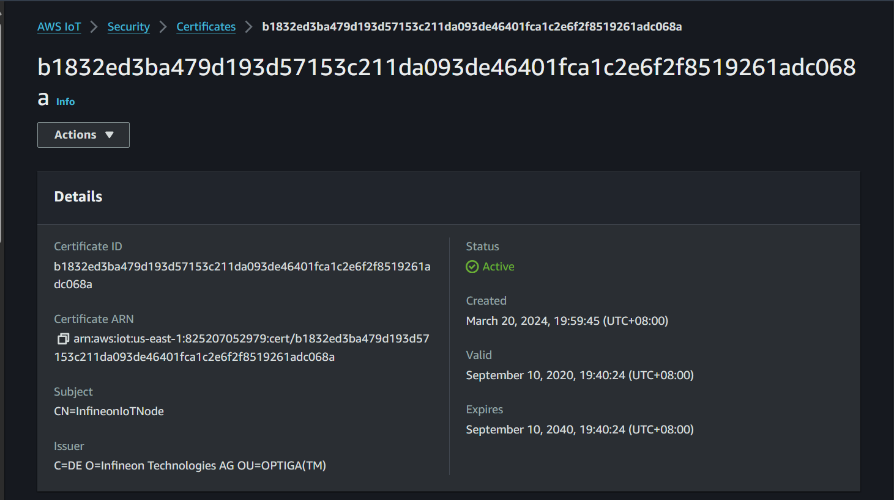
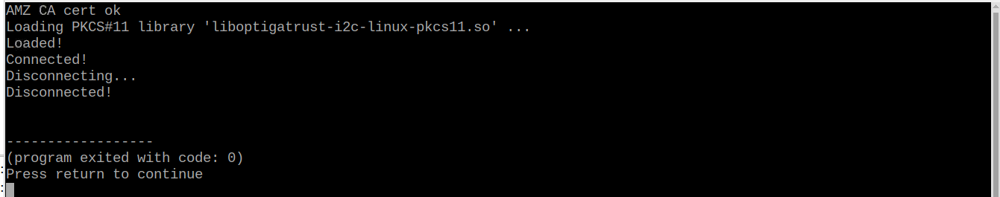

<!--
SPDX-FileCopyrightText: 2024 Infineon Technologies AG

SPDX-License-Identifier: MIT
-->

# OPTIGA™ Trust M Linux Setup Guide for AWS IOT Core

## <a name="AboutThisDocument"></a>About this document

### <a name="Scopeandpurpose"></a>Scope and purpose 

AWS IoT core makes use of X.509 certificates to authenticate client or device connections during a registration and onboarding attempt. The purpose of this document is to guide users on how to set up their AWS IOT Core to establish a MQTT client connection using X.509 certificate with a OPTIGA™ Trust M private key. 

### <a name="Tablesofcontents"></a>Tables of contents

- [OPTIGA™ Trust M Linux Setup Guide for AWS IOT Core](#optiga-trust-m-linux-setup-guide-for-aws-iot-core)
  - [About this document](#about-this-document)
    - [Scope and purpose](#scope-and-purpose)
    - [Tables of contents](#tables-of-contents)
  - [Prerequisites](#prerequisites)
    - [Setup Raspberry Pi](#setup-raspberry-pi)
    - [AWS Python PKCS#11 client configuration](#aws-python-pkcs11-client-configuration)
    - [Installing AWS Python Library](#installing-aws-python-library)
  - [Setting up AWS IoT account](#setting-up-aws-iot-account)
    - [Setting up AWS IOT configuration](#setting-up-aws-iot-configuration)
    - [Examples used in previous chapter:](#examples-used-in-previous-chapter)
  - [Connect To AWS IoT](#connect-to-aws-iot)

## <a name="prerequisites"></a>Prerequisites

### <a name="SetupRPI"></a>Setup Raspberry Pi

- Refer to [README.md](../../README.md) for Setting up Linux environment on Raspberry Pi

### <a name="AWSPythonPKCS11clientconfiguration"></a>AWS Python PKCS#11 client configuration

The AWS IoT Core Client ID and Device Data Endpoint need to be configured in the MQTT client software shown below, for example:

- OPTIGA™ Trust M thing Client ID: arn:aws:iot:us-west-2:767398033664:thing/Rpi-TrustM-PKCS11

- Device Data Endpoint: a2kfkheds2p7dx-ats.iot.us-west-2.amazonaws.com

See [a0_connect.sh](a0_connect.sh):
```bash
#######################################################################################
# AWS IoT configuration
#######################################################################################
export DEVICE_CERT_PATH=certificates/mycert0.pem

export AWS_CERT_PATH=certificates/AmazonRootCA1.pem

export IOT_CORE_ENDPOINT=a2kfkheds2p7dx-ats.iot.us-west-2.amazonaws.com

export CLIENT_ID=arn:aws:iot:us-west-2:767398033664:thing/Rpi-TrustM-PKCS11
```


### <a name="installingawspythonlibrary"></a>Installing AWS Python Library


- Install AWS Python Library:

  ```bash
  python3 -m pip install awsiotsdk 
  ```

  *** Note: if you are running Raspberry Pi OS Bookworm or newer and is facing Error "error: externally-managed-environment", run***

  ```bash
  sudo rm /usr/lib/python3.11/EXTERNALLY-MANAGED
  python3 -m pip install awsiotsdk 
  ```

- Run "read_cert_slot0.sh" script to read certificate for slot 0

  ``` bash
  chmod +x read_cert_slot0.sh
  ./read_cert_slot0.sh
  ```

  Certificates "mycert0.pem" and will be found in the certificate directory.


- Run "generate_cert_slot1.sh" script to generate certificate for slot 1

  ```bash
  chmod +x generate_cert_slot1.sh
  ./generate_cert_slot1.sh 
  ```

  Certificates "mycert1.pem" and will be found in the certificate directory.


## <a name="SettingupAWSIoTaccount"></a>Setting up AWS IoT account

- Open https://aws.amazon.com/ web page

- Click "Sign in to the Console"

​	

[^Figure 2]:AWS web page

- Select Root user and create new account (follow the steps)


[^Figure 3]: AWS Sign in Console

### <a name="Setting up AWS IOT configuration"></a>Setting up AWS IOT configuration

- Select IoT Core



[^Figure 4]: AWS Console Home

- Expand Manage and click on "Things"


[^Figure 5]:AWS IoT sidebar menu

- Click on "Create Things" - Select "Create single thing"


[^Figure 6]:Create things menu

- Name your thing and keep the default "No shadow selection", then click  "Next"


[^Figure 7]:Thing properties and Shadow selection

- Select "Skip creating a certificate at this time", then click "Create Thing"


[^Figure 8]: Thing certificate configuration

- Below is the example Things created for the OPTIGA™ Trust M kits




[^Figure 9]: Thing created example

- Upload and Register the Device Certificate extracted from the OPTIGA™ Trust M Kit. The Device Certificate should be saved in a .pem file

- Security --> Certificates --> Add certificate --> Register certificates



[^Figure 10]: Certificate menu


[^Figure 11]: Register certificate menu

- Choose “CA is not registered with AWS IoT” and click on upload.

- Upload the Device Certificate.


[^Figure 12]:Certificate selection "mycert.pem" from "generate_cert.sh"

- Activate the Registered Device Certificate.

- Register the Device Certificate.


[^Figure 13]:Activated certificate

- Successful registered certificate will be added in the list of certificates as shown below. 


[^Figure 14]: Certificate list 

- To determine which is the Device Certificate, select it and open it. (It should contain Infineon Technologies as the issuer.)
- ***note this should be reflected on both registered certificates***



[^Figure 15]: Certificate details of device 

- Attach the certificate to a Thing (OPTIGA™ Trust M Kit). 

- ***note the steps specified should be done for both certificates***

- Actions --> Attach to things


[^Figure 16]: Attaching certificate to things

- Choose a thing for OPTIGA™ Trust M and select “Attach to thing” as shown below.


[^Figure 17 ]: Choosing thing example

- Create New Policy for the Thing (OPTIGA™ Trust M Kit).

- Security --> Policies --> Create policy


[^Figure 18]: Create policy example

- Enter Policy name (ex. AllAllowedPolicy). 

- Choose Policy document Builder or JSON and enter the content as shown below. 


[^Figure 19a]:Create policy with Builder menu


[^Figure 19b]: Create policy with JSON menu

- Click on Create.


[^Figure 20]: Created policy

- New Policy created will be displayed as shown below.


[^Figure 21]: Policy list

- Attach Policy to the Device Certificate.

- ***note the steps specified should be done on both certificates***

- Security --> Certificates --> Select the Device Certificate --> Actions --> Attach Policy


[^Figure 22]: Attaching policy example

- Select the Policy and choose Attach policies.


[^Figure 23]: Choosing policy

- Successful New Policy attached shown below.


[^Figure 24]: Successful attached policy example

- Broker IOT Endpoint. Click on Settings. Device data endpoint shown below.


[^Figure 25]: Endpoint example

- This endpoint needs to be copied in the MQTT Client as in [AWS Python PKCS#11 client configuration](#aws-python-pkcs11-client-configuration) 

### Examples used in previous chapter:

- OPTIGA™ Trust M thing: arn:aws:iot:us-west-2:767398033664:thing/Rpi-TrustM-PKCS11

- Device Data Endpoint: a2kfkheds2p7dx-ats.iot.us-west-2.amazonaws.com


## <a name="ConnectToAWSIoT"></a>Connect To AWS IoT


- Connect to AWS IoT using slot 0

    Run "a0_connect.sh" to connect to connect to AWS IoT as follow

    ```bash
    chmod +x a0_connect.sh
    ./a0_connect.sh
    ```


[^Figure 26]: a0_connect.sh output

- Connect to AWS IoT using slot 1

    Run "a1_connect.sh" to connect to connect to AWS IoT as follow

    ```bash
    chmod +x a1_connect.sh
    ./a1_connect.sh
    ```
    



[^Figure 27]: a1_connect.sh output
